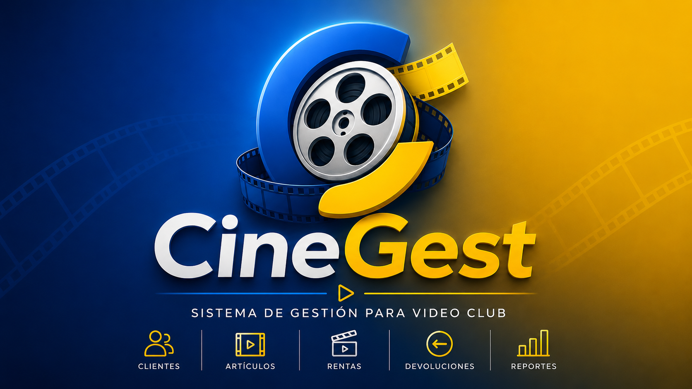

<p align="center">
  
  
</p>
<p align="center">
    
</p>


<p align="center">
  <strong>La solución inteligente para la gestión de Video Clubs.</strong><br>
  Proyecto web profesional en evolución, desarrollado con Python y Django.
</p>

<p align="center">
  
  
  
  
</p>

---

# 📖 Descripción

**CineGest** es una nueva versión profesional de un sistema académico de gestión para Video Club.

La aplicación será desarrollada desde cero con una arquitectura modular en Django y tendrá como objetivo centralizar la administración de catálogos, artículos, clientes, empleados, rentas, devoluciones, reportes y seguridad del sistema.

El proyecto se encuentra actualmente en su fase inicial de preparación técnica. La estructura base de Django, el control de versiones, la documentación principal y la organización inicial del repositorio ya están configurados.

**CineGest** forma parte de una colección de proyectos académicos desarrollados en la **Universidad APEC (UNAPEC)**, tomando como referencia el listado de proyectos propuestos por el profesor **Juan Pablo Valdez Reyes**.

---

# 🎓 Origen del Proyecto

La versión académica original fue desarrollada durante el **primer cuatrimestre de 2026** como proyecto final de la asignatura **Desarrollo de Software con Tecnología Open Source I (ISO-610)**, impartida por el profesor **Omar de la Cruz** en la **Universidad APEC (UNAPEC)**.

El proyecto original fue realizado en equipo utilizando **Python, Django y SQLite**.

La versión actual, denominada **CineGest**, utiliza dicho proyecto como referencia funcional y académica, pero será reconstruida desde cero con una arquitectura, una base de código y una identidad propias.

Repositorio del proyecto académico original: [MDGreenCode/GestionVideoClub](https://github.com/MDGreenCode/GestionVideoClub)

---

## 👥 Equipo Académico Original

| 👤 Integrante | 🆔 Matrícula |
|---|---|
| 👨🏻‍💻 Carlos Jesús Bobea Mejía | A00091229 |
| 👨🏻‍💻 Mario David Pichardo Vásquez| A00114273 |
| 👨🏻‍💻 Francis Jairo Matías Rosario | A00115261 |
| 👩🏻‍💻 Pieranyela José Carrasco Rodríguez | A00116415 |
| 👨🏻‍💻 Jenrry Monegro Rosario | A00116621 |


## 🎓 Información Académica

| Información | Detalle |
|---|---|
| 📖 Asignatura | Desarrollo de Software con Tecnologia Open Source 1 (ISO-610) |
| 👨‍🏫 Profesor | Ing. Omar Antonio De Jesus De La Cruz Gonzalez |
| 🏫 Institución | Universidad APEC (UNAPEC) |
| 📅 Período académico | Enero - Abril 2026 |
| 📁 Tipo de entrega | Proyecto Final |

## 🧭 Continuidad académica

**CineGest** forma parte de una continuidad docente compartida con [**MediCore**](https://github.com/Jairo0811/MediCore) dentro de la formación de Ingeniería de Software en la Universidad APEC (UNAPEC). La relación entre ambos proyectos es **académica y formativa**: no existe una dependencia técnica entre las aplicaciones, sino la coincidencia del mismo profesor en dos asignaturas diferentes cursadas durante el mismo período.

Durante **Enero - Abril de 2026**, el profesor **Ing. Omar Antonio De Jesus De La Cruz Gonzalez** impartió tanto **Desarrollo de Software con Tecnología Propietaria 1 (ISO-605)** como **Desarrollo de Software con Tecnología Open Source 1 (ISO-610)**, asignaturas en las que Francis Jairo Matías Rosario participó en los proyectos finales MediCore y CineGest respectivamente.

| Orden | Código | Asignatura | Proyecto | Período | Vínculo de continuidad |
|---:|---|---|---|---|---|
| 1 | ISO-605 | Desarrollo de Software con Tecnología Propietaria 1 | [**MediCore**](https://github.com/Jairo0811/MediCore) | Enero - Abril 2026 | Mismo profesor |
| 2 | ISO-610 | Desarrollo de Software con Tecnología Open Source 1 | **CineGest** | Enero - Abril 2026 | Mismo profesor |

Vistos en conjunto, ambos proyectos documentan una experiencia paralela con el mismo docente en dos líneas complementarias del plan de estudios: **tecnología propietaria** y **tecnología open source**. Cada repositorio conserva su identidad, equipo y alcance académico original, y su relación se documenta exclusivamente como continuidad docente.

### 🏫 Cruce institucional ITLA → UNAPEC

CineGest también documenta un cruce institucional particular entre **ITLA** y **UNAPEC**. Además de Francis Jairo Matías Rosario, tres integrantes del equipo académico original de CineGest también cursaron estudios en el **Instituto Tecnológico de Las Américas (ITLA)** antes de coincidir posteriormente en UNAPEC.

Esta relación **no representa continuidad por materias compartidas en ITLA**. Francis Jairo Matías Rosario **no coincidió con Mario David Pichardo Vásquez, Pieranyela José Carrasco Rodríguez ni Jenrry Monegro Rosario en ninguna asignatura durante su etapa en ITLA**. El vínculo documentado es exclusivamente una **trayectoria institucional compartida**: estudiantes provenientes del ITLA que posteriormente coincidieron como integrantes del mismo proyecto en UNAPEC.

| Integrante | Matrícula UNAPEC | Matrícula ITLA | Relación documentada |
|---|---|---|---|
| **Mario David Pichardo Vásquez** | A00114273 | **2015-2935** | ITLA → UNAPEC; sin materias compartidas con Francis Jairo en ITLA |
| **Francis Jairo Matías Rosario** | A00115261 | **2015-2984** | ITLA → UNAPEC |
| **Pieranyela José Carrasco Rodríguez** | A00116415 | **2019-8767** | ITLA → UNAPEC; sin materias compartidas con Francis Jairo en ITLA |
| **Jenrry Monegro Rosario** | A00116621 | **2019-8690** | ITLA → UNAPEC; sin materias compartidas con Francis Jairo en ITLA |

Este cruce permite documentar una dimensión distinta de la continuidad académica del portafolio: no la repetición de un profesor o compañero dentro de una misma institución, sino la convergencia posterior en UNAPEC de varios estudiantes con formación previa en ITLA. La coincidencia relevante ocurre en **CineGest (ISO-610, Enero - Abril 2026)**, no durante la etapa de Francis Jairo Matías Rosario en ITLA.

**Mario David Pichardo Vásquez** fue el principal creador y desarrollador de la versión original que sirve como punto de partida e inspiración para la evolución de **CineGest**.

---

# 🛠️ Stack tecnológico

## 🎨 Frontend y diseño de interfaces

<p>
  
</p>

- **HTML5:** estructura semántica de las vistas.
- **CSS3:** estilos y personalización visual.
- **Bootstrap 5:** componentes responsivos para la interfaz.
- **Django Templates:** renderizado del lado del servidor.

## ⚙️ Backend y lógica de aplicación

<p>
  
</p>

- **Python 3.13:** lenguaje principal.
- **Django 5.2.15:** framework web.
- **Django ORM:** persistencia de datos.
- **Arquitectura MVT:** organización del proyecto.

## 🗄️ Base de datos y persistencia

<p>
  
</p>

- **SQLite:** motor temporal durante la fase inicial.
- **Microsoft SQL Server:** motor planificado para la versión profesional.
- **Migraciones de Django:** control de cambios del esquema.

## 🧰 Herramientas de desarrollo

<p>
  
</p>

- **Visual Studio Code:** entorno de desarrollo.
- **Git:** control de versiones.
- **GitHub:** alojamiento y administración del repositorio.
- **pip:** gestión de dependencias.
- **venv:** aislamiento del entorno local.

---

# 🏗️ Arquitectura

CineGest se está organizando como una aplicación Django modular:

```text
Navegador
    │
    ▼
Django URLs
    │
    ▼
Views / Use Cases
    │
    ▼
Forms / Services
    │
    ▼
Models / Django ORM
    │
    ▼
SQLite → Microsoft SQL Server
```

La arquitectura prevista separará responsabilidades por módulos de negocio dentro de `apps/`.

Módulos planificados:

```text
apps/
├── core
├── accounts
├── dashboard
├── catalogos
├── clientes
├── empleados
├── articulos
├── rentas
└── reportes
```

---

# 📂 Estructura actual del proyecto

```text
CineGest
│
├── apps
│   └── __init__.py
│
├── config
│   ├── __init__.py
│   ├── settings.py
│   ├── urls.py
│   ├── asgi.py
│   └── wsgi.py
│
├── docs
├── media
├── static
├── templates
├── manage.py
├── requirements.txt
├── .gitignore
└── README.md
```

---

# ✅ Estado actual

| Componente | Estado |
|------------|:------:|
| Proyecto Django inicial | ✅ |
| Repositorio privado en GitHub | ✅ |
| Archivo `.gitignore` | ✅ |
| Archivo `requirements.txt` | ✅ |
| README profesional | ✅ |
| Estructura modular base | ✅ |
| Configuración regional | 🔄 |
| Variables de entorno | ⏳ |
| Módulo de autenticación | ⏳ |
| Dashboard | ⏳ |
| Catálogos | ⏳ |
| Clientes | ⏳ |
| Empleados | ⏳ |
| Artículos | ⏳ |
| Rentas y devoluciones | ⏳ |
| Reportes | ⏳ |
| SQL Server | ⏳ |
| Interfaz responsiva | ⏳ |

> **Leyenda:** ✅ completado · 🔄 en progreso · ⏳ pendiente

---

# 🗺️ Hoja de ruta

## Fase 1 — Preparación técnica

- [x] Crear el proyecto Django.
- [x] Crear el repositorio privado.
- [x] Configurar `.gitignore`.
- [x] Generar `requirements.txt`.
- [x] Crear la estructura inicial del repositorio.
- [ ] Configurar variables de entorno.
- [ ] Ajustar configuración regional y archivos estáticos.

## Fase 2 — Arquitectura y seguridad

- [ ] Crear aplicación `core`.
- [ ] Crear aplicación `accounts`.
- [ ] Definir usuario personalizado.
- [ ] Implementar login, roles y permisos.
- [ ] Incorporar auditoría y eliminación lógica.

## Fase 3 — Modelo de dominio

- [ ] Diseñar el modelo entidad-relación.
- [ ] Crear catálogos.
- [ ] Crear clientes y empleados.
- [ ] Crear artículos, géneros, idiomas y elenco.
- [ ] Crear rentas, detalles y devoluciones.

## Fase 4 — Base de datos

- [ ] Configurar Microsoft SQL Server.
- [ ] Definir restricciones e índices.
- [ ] Crear migraciones.
- [ ] Preparar datos iniciales.

## Fase 5 — Interfaz

- [ ] Integrar Bootstrap 5.
- [ ] Crear layout principal.
- [ ] Diseñar dashboard.
- [ ] Añadir búsquedas, filtros y paginación.
- [ ] Implementar diseño responsivo y modo oscuro.

## Fase 6 — Reportes y producción

- [ ] Reportes por criterios.
- [ ] Exportación a PDF.
- [ ] Exportación a Excel.
- [ ] Pruebas automatizadas.
- [ ] Documentación técnica.
- [ ] Preparación para despliegue.

---

# 🚀 Instalación

## 1️⃣ Clonar el repositorio

```bash
git clone https://github.com/Jairo0811/CineGest.git
cd CineGest
```

## 2️⃣ Crear el entorno virtual

```powershell
py -3.13 -m venv .venv
```

## 3️⃣ Activar el entorno virtual

### Windows PowerShell

```powershell
.\.venv\Scripts\Activate.ps1
```

### Windows CMD

```cmd
.venv\Scripts\activate
```

### Linux o macOS

```bash
source .venv/bin/activate
```

## 4️⃣ Instalar dependencias

```bash
python -m pip install --upgrade pip
python -m pip install -r requirements.txt
```

## 5️⃣ Aplicar migraciones

```bash
python manage.py migrate
```

## 6️⃣ Ejecutar el servidor

```bash
python manage.py runserver
```

Aplicación local:

```text
http://127.0.0.1:8000/
```

Panel administrativo:

```text
http://127.0.0.1:8000/admin/
```

---

# ⚙️ Configuración actual

```text
Python 3.13
Django 5.2.15
SQLite temporal
```

La configuración principal se encuentra en:

```text
config/settings.py
```

La migración a Microsoft SQL Server se realizará después de definir el modelo de dominio.

---

# 👨‍💻 Autor y mantenimiento

**Francis Jairo Matías Rosario**

🎓 Universidad APEC (UNAPEC)

📚 Ingeniería de Software

🆔 Matrícula: **A00115261**

💼 Evolución y mantenimiento de **CineGest** como proyecto académico y profesional.

---

# 🙏 Créditos

- **Universidad:** Universidad APEC (UNAPEC)
- **Asignatura:** Desarrollo de Software con Tecnología Open Source I
- **Código:** ISO-610
- **Profesor de la asignatura:** Omar de la Cruz
- **Referencia académica:** listado de proyectos propuestos por el profesor Juan Pablo Valdez Reyes
- **Desarrollador principal del proyecto académico original:** Mario David Pichardo Vásquez
- **Repositorio académico original:** [MDGreenCode/GestionVideoClub](https://github.com/MDGreenCode/GestionVideoClub)
- **Evolución y mantenimiento de CineGest:** Francis Jairo Matías Rosario

---

<p align="center">
  Desarrollado con ❤️ por <strong>Francis Jairo Matías Rosario</strong>
</p>
